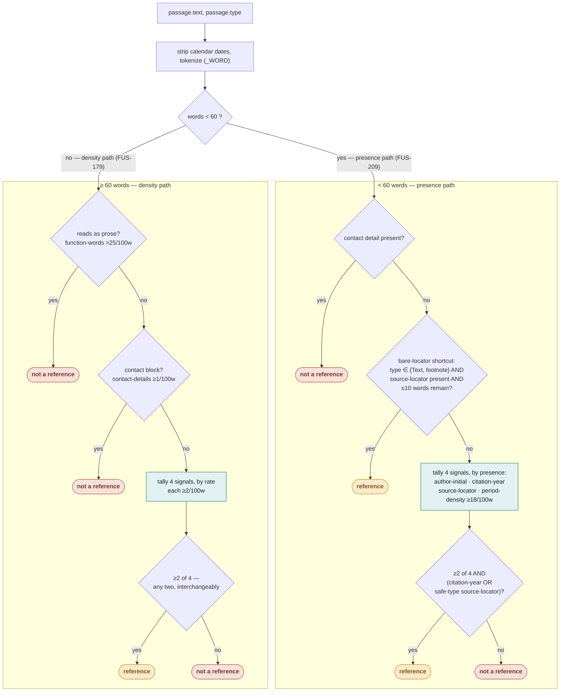

# `looks_like_reference_list(passage)`

One ruleset, two regimes. Above `_DENSITY_MIN_WORDS` (60 words) the four
citation signals are measured **as rates**, because a rate calibrated on whole
reference-list passages needs many entries to average across. Below it, presence
replaces rate, and a source-locator or citation-year must specifically be among
the two signals found — the other two fire on headings and signature blocks just
as readily as on citations.

## The four signals

| Signal           | Regex / measure               | Long path (≥60 words) | Short path (&lt;60 words)                                                |
| ---------------- | ----------------------------- | --------------------- | ------------------------------------------------------------------------ |
| `author-initial` | "Hansen, J." / "J. Hansen"    | rate ≥ 2/100w         | present                                                                  |
| `citation-year`  | "(2019)." closing an entry    | rate ≥ 2/100w         | present — **counts as a strong signal, any content type**                |
| `source-locator` | `doi:`, URL, "Retrieved from" | rate ≥ 2/100w         | present — **counts as strong only if `passage.type ∈ {Text, footnote}`** |
| `period-density` | periods per word              | rate ≥ 18/100w        | rate ≥ 18/100w (stays a rate at both lengths)                            |

Both paths require **≥2 of the 4 signals**. The short path adds one more
condition: at least one of the two present signals must be `citation-year` or a
safely-typed `source-locator` — `author-initial` + `period-density` alone is not
enough, because that exact pair also fires on section headings, map legends and
signature blocks.

## Vetoes and shortcuts

- **Contact veto** (both paths) — a phone number or email means it's a directory
  or signature block, not a citation.
- **Prose veto** (long path only) — function-word rate over 25/100w reads as
  ordinary prose.
- **Bare-locator shortcut** (short path only) — a passage that is essentially
  _just_ a locator (`"89 http://www.um.edu.mt/ceer."`) is a reference on that
  signal alone, restricted to `Text`/`footnote` content: a bare URL in a
  `pageHeader`/`pageFooter` is as often the document's own repeating permalink
  as a genuine citation. See below for the full content-type story.

## Content-type exclusions

`passage.type` (`content_type` in the feeder) is a parser-assigned label.
Production has 8 real values, head-heavy toward `Text`:

| content_type     | share of corpus (approx.) |
| ---------------- | ------------------------- |
| `Text`           | ~45%                      |
| `sectionHeading` | ~17%                      |
| `List`           | ~14%                      |
| `Table`          | ~7%                       |
| `title`          | ~5%                       |
| `pageFooter`     | ~4%                       |
| `pageHeader`     | ~4%                       |
| `footnote`       | ~3%                       |

Only two of the four signals are gated by it, and only below the density floor —
the two involving a locator, because a URL or DOI is the one signal shape that
can also be the _document's own_ boilerplate rather than a citation to something
else:

| Signal / rule                                                  | Content-type restriction                                           | Why                                                                                                                                                                                                                                                                                                                                                                                                                           |
| -------------------------------------------------------------- | ------------------------------------------------------------------ | ----------------------------------------------------------------------------------------------------------------------------------------------------------------------------------------------------------------------------------------------------------------------------------------------------------------------------------------------------------------------------------------------------------------------------- |
| `source-locator`, as the short path's required "strong" signal | counts only in `Text` / `footnote` (`_BARE_LOCATOR_CONTENT_TYPES`) | a bare URL in `pageHeader`/`pageFooter` is at least as often the document's own repeating CDN permalink or an "Electronically signed by:" verification link as a genuine citation, and the two are textually indistinguishable. A hand-labelled, fresh disagreement sample measured this directly rather than assuming it: of 40 `pageHeader`/`pageFooter` passages this signal newly caught, only 23 were genuine citations. |
| bare-locator shortcut                                          | fires only in `Text` / `footnote`                                  | same reasoning — the shortcut exists for footnotes that are essentially just a locator, which is exactly the shape where that ambiguity applies.                                                                                                                                                                                                                                                                              |
| `citation-year`                                                | **none** — accepted at any content type                            | no equivalent self-referential-text ambiguity was found for a citation year specifically.                                                                                                                                                                                                                                                                                                                                     |
| `author-initial`, `period-density`                             | **none**                                                           | never content-type-gated; relied on instead being insufficient alone (see the &ge;2-of-4-plus-one-strong-signal rule above).                                                                                                                                                                                                                                                                                                  |
